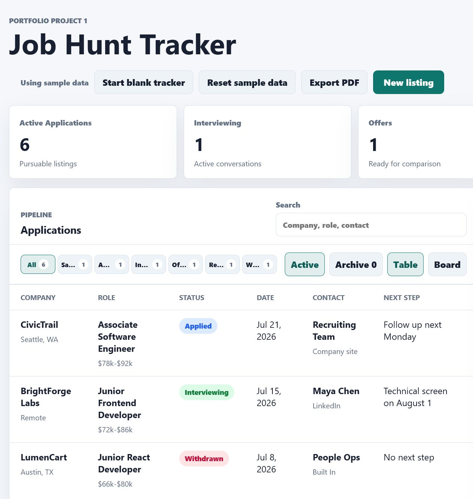
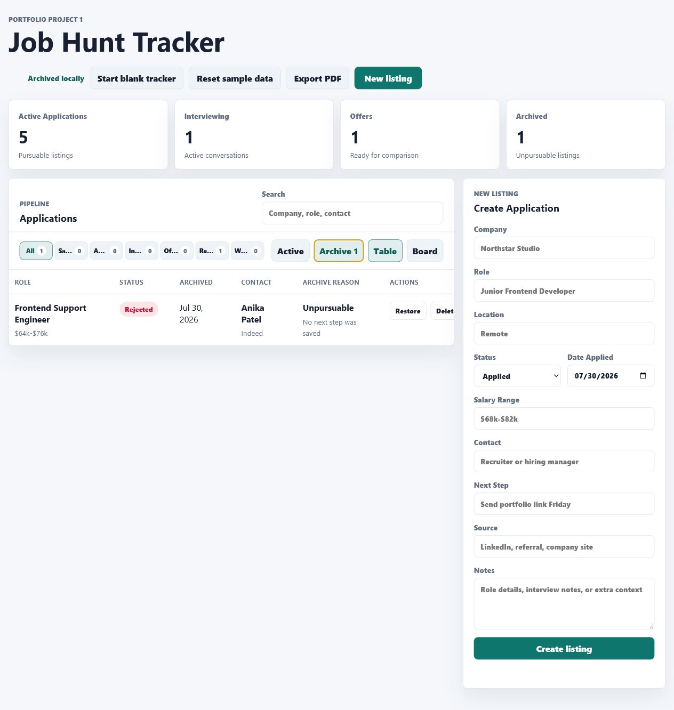
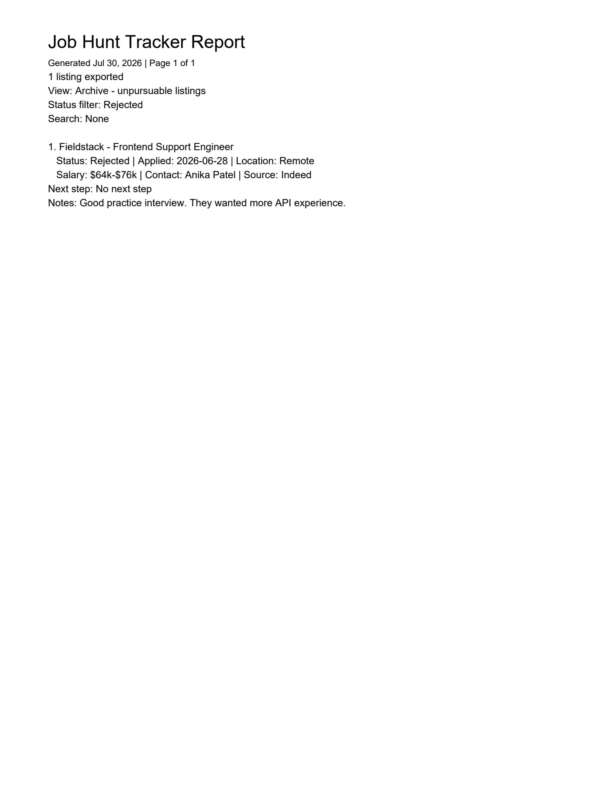

# Job Hunt Tracker Case Study

## Overview

Job Hunt Tracker is a portfolio-ready web app that helps job seekers manage applications, focus on active opportunities, and archive roles that are no longer pursuable. The project is intentionally scoped as a realistic early-career front-end build: it includes product requirements, a data model, local persistence, export behavior, tests, documentation, and a deployed static site.

## Problem

Job searches can get messy quickly. A job seeker may have saved roles, submitted applications, interviews, offers, rejections, and withdrawn opportunities all mixed together. The goal was to make a focused tracker that keeps active opportunities visible while still preserving historical context.

## Target User

The target user is a junior developer, student, career changer, or early-career professional applying to multiple roles at once. They need a lightweight tool that works without an account and can be opened quickly from a browser.

## Product Goals

- Show the full application pipeline in a table or board view.
- Let users create, edit, delete, search, and filter listings.
- Save changes in browser-local storage so the tracker survives refreshes.
- Archive rejected or withdrawn jobs as unpursuable without deleting their history.
- Export the current filtered view to a readable PDF report.
- Keep the app simple enough to run locally or on GitHub Pages.

## Key Decisions

- Static app first: The first version uses HTML, CSS, and JavaScript so it can run with no backend setup.
- Browser-local persistence: `localStorage` gives the app useful save/load behavior while keeping the MVP lightweight.
- Domain helpers: Filtering, stats, archive rules, PDF export, create/update/delete, and storage helpers are separated from DOM code so they can be tested.
- Archive as state, not deletion: Archived jobs remain in the same saved collection with `archivedAt` and `archiveReason`, which makes restore behavior straightforward.
- Guarded archive rule: Only rejected or withdrawn jobs can be archived, matching the product idea of "unpursuable" listings.

## Build Notes

- `src/app.js` handles UI state, rendering, form behavior, and browser events.
- `src/domain.js` contains reusable business logic and PDF generation.
- `src/storage.js` isolates browser storage behavior.
- `dist/app.bundle.js` is generated from `src/*.js` so the app works when opened by double-clicking `Open Job Hunt Tracker.html`.
- `tests/*.test.js` uses Node's built-in test runner.

## Quality Checks

- 19 automated tests cover filtering, searching, summary stats, create/update/delete, archive/restore rules, PDF export, and storage behavior.
- Browser checks verified that status filters stay in one row without horizontal scrolling.
- Browser checks verified that Active/Archive does not overlap Table/Board.
- Browser checks verified that Archive only appears on rejected or withdrawn sample jobs.
- The live GitHub Pages deployment was checked after publishing.

## Screenshots

## Future Improvements

- Add JSON backup import/export so users can move data between browsers.
- Add optional backend persistence for multi-device sync.
- Add richer application notes, interview rounds, and contact history.
- Add accessibility-focused keyboard testing for table, board, and form workflows.
